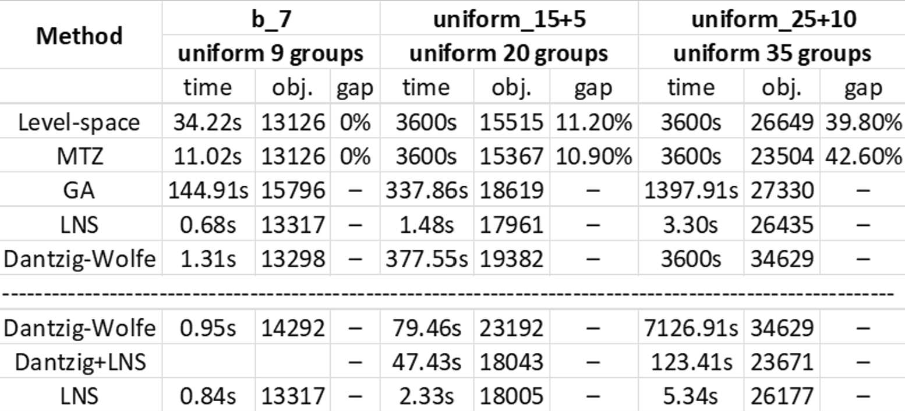

# School Bus Routing: Exact Optimization vs. Scalable Heuristics

An optimization research project for the **School Bus Routing Problem (SBRP)**. The project studies how to build feasible bus routes while balancing operational efficiency with a less visible objective: fairness in students' in-vehicle time.

Rather than treating SBRP as a single-solver exercise, I implemented an experimental framework that compares exact optimization, decomposition, and metaheuristics as the problem grows from **N = 30 to 50 and 80 stops**.



## Problem

Given student demand at multiple pickup stops and destination schools, construct routes that:

- serve every student and deliver them to the correct school;
- respect bus-capacity and maximum-route-duration constraints;
- minimize fleet size, total travel time, and student in-vehicle time; and
- avoid systematically giving students from the same school disproportionately long rides.

The weighted objective used throughout the project is:

$$
\min\; w_b \cdot \text{buses}
+ w_t \cdot \text{travel time}
+ w_r \cdot \text{in-vehicle time}
+ w_f \cdot \text{fairness penalty}
$$

This formulation makes the central research question explicit: **how much efficiency should be traded for a fairer distribution of student travel burden?**

## My Contribution

- Built a shared route simulation and feasibility layer so every solver is evaluated under the same capacity, duration, demand, and fairness rules.
- Implemented an **exact Gurobi solver** as a small-instance benchmark.
- Implemented **Dantzig–Wolfe decomposition with column generation**, including reduced-cost pricing and fairness-aware route generation.
- Developed scalable **Greedy, Genetic Algorithm, Ant Colony Optimization, and Large Neighborhood Search** solvers.
- Combined column generation with an **LNS pricing heuristic** to explore the middle ground between exact optimization and practical scalability.
- Designed experiments at **N = 30, 50, and 80** to compare solution quality and computational tractability as instance size increases.

## Results & Engineering Takeaways

The experiments expose the expected but important optimization trade-off:

- **Exact optimization** provides a quality reference for smaller instances, but exhaustive feasible-route generation becomes the scalability bottleneck.
- **Metaheuristics** give up optimality guarantees in exchange for the ability to search larger instances within a practical runtime.
- **Column generation** avoids enumerating every route upfront, while heuristic pricing further improves scalability when exact pricing is too expensive.
- **Fairness is not free**: changing its weight can alter route composition and travel time, so it must be evaluated alongside cost—not added only after routing.

The figure above summarizes the N=30/50/80 experiments. It is intended as an empirical comparison of solver behavior, not a claim that every heuristic reaches the global optimum.

## What I Learned

- A mathematically stronger formulation is not automatically the best engineering solution; the useful method depends on instance size and runtime budget.
- Exact solvers are valuable beyond deployment: they provide baselines for measuring heuristic quality on tractable cases.
- Separating route construction, feasibility checks, and objective evaluation makes very different algorithms directly comparable.
- Multi-objective routing requires reporting the components of cost. A single objective value can hide whether an improvement came from fewer buses, shorter routes, or reduced unfairness.

## Implemented Methods

| Method | Role in the project | Entry point |
|---|---|---|
| Exact optimization (Gurobi) | Small-instance benchmark | `exact_solver.py` |
| Dantzig–Wolfe / column generation | Decomposition-based optimization | `dantzig-wolfe_solver.py` |
| Column generation + LNS pricing | Scalable route-column discovery | `dantzig+lns_solver.py` |
| Large Neighborhood Search | Destroy-and-repair local search | `lns_solver.py` |
| Genetic Algorithm | Population-based search | `ga_solver.py` |
| Ant Colony Optimization | Pheromone-guided constructive search | `aco_solver.py` |
| Greedy construction | Fast baseline and initial solution | `greedy_solver.py` |

## Quick Start

```bash
git clone https://github.com/excellent77/SBRP_algorithms.git
cd SBRP_algorithms
pip install -r requirements.txt
```

Gurobi-based methods require a working Gurobi installation and license. A free academic license is available for eligible users.

Place the input files in `./data/`, then run a solver directly:

```bash
python greedy_solver.py
python lns_solver.py
python ga_solver.py
python aco_solver.py
python exact_solver.py
python dantzig-wolfe_solver.py
python dantzig+lns_solver.py
```

The example instance paths and algorithm parameters are defined in each script's `if __name__ == "__main__":` block.

## Data Format

Each instance consists of two CSV files:

- `stops-*.csv`: pickup-stop ID, original matrix index, destination school, and student demand.
- `time-*.csv`: square origin-to-origin travel-time matrix covering stops and schools.

Each solver prints a solution summary including objective cost, bus count, total route time, total in-vehicle time, feasibility, and route details.

## Project Structure

```text
.
├── exact_solver.py                 # exact Gurobi benchmark
├── dantzig-wolfe_solver.py         # column generation
├── dantzig+lns_solver.py           # column generation with LNS pricing
├── greedy_solver.py                # constructive baseline
├── ga_solver.py                    # genetic algorithm
├── aco_solver.py                   # ant colony optimization
├── lns_solver.py                   # large neighborhood search
├── utils/                          # data models, simulation, and I/O
└── docs/                           # algorithm notes and experiment results
```
